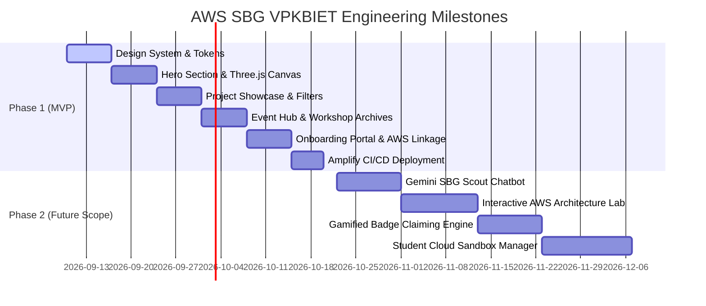
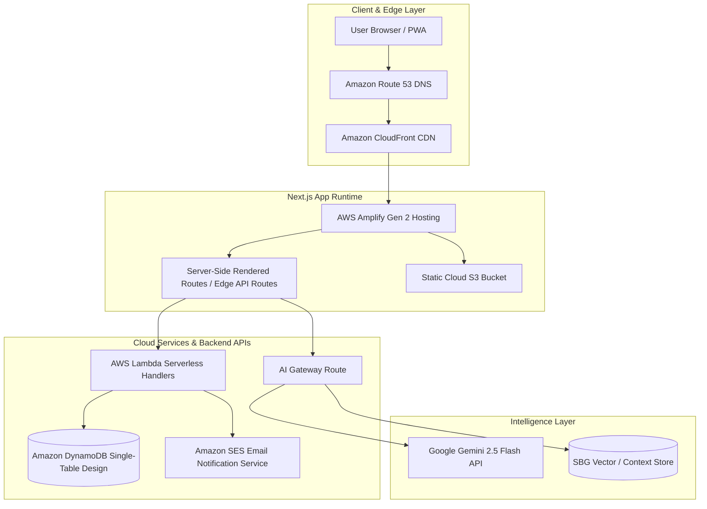

# AWS Student Builder Group (SBG) - VPKBIET
## Official Web Platform: Comprehensive System Architecture & Engineering Blueprint

---

**Document Version:** 1.0.0  
**Status:** Approved for Implementation  
**Target Organization:** AWS Student Builder Group — Vidya Pratishthan's Kamalnayan Bajaj Institute of Engineering and Technology (VPKBIET), Baramati  
**Lead Architect & UI/UX Director:** Senior Cloud Solutions Architect & Lead UI/UX Designer  
**Classification:** Open Community Technical Specification & Source of Truth  

---

## 1. Executive Summary & Architectural North Star

The **AWS Student Builder Group (SBG) at VPKBIET** represents an elite student-led engineering collective situated in Baramati, Maharashtra. Our mission is to bridge academic computer science theory with industrial-grade cloud engineering, distributed systems, and applied artificial intelligence. 

This technical blueprint establishes the architectural foundation, user experience guidelines, and operational workflow for the official AWS SBG VPKBIET web portal. The platform serves three strategic imperatives:
1. **Technical Authority:** Emulate the engineering rigor, visual elegance, and performance standard of the AWS Management Console and the AWS Builder Center.
2. **Community & Talent Acceleration:** Provide real-time event indexing, workshop curricula, transparent membership onboarding, and a verified milestone/credentialing engine.
3. **Regional Socio-Technical Impact:** Spotlight student innovations (e.g., *EcoNutri AI*, *SkipShop AI*, *Skipline Go*) designed to solve real-world agricultural, retail, and infrastructural challenges across the Baramati and Pune rural-urban corridors.

---

## 2. Information Architecture & Wireframe Hierarchy

### 2.1 Complete Sitemap

```
AWS SBG VPKBIET Platform (Root)
│
├── 01. / (Home / Landing Hub)
│   ├── Dynamic 3D Cloud Constellation (Three.js Hero)
│   ├── Mission & Core Pillars (Innovation, Hands-on, Eco-Sustainability, AWS Proficiency)
│   ├── Live Stats Ticker (Active Builders, Certifications, Workspaces, Hackathon Wins)
│   ├── Regional Impact Spotlight (Baramati Agri-Tech & Local Commerce Solutions)
│   ├── Upcoming Flagship Event Banner
│   └── Quick Join / Onboarding Gateway
│
├── 02. /projects (Builder Showcase & Innovation Lab)
│   ├── Category Filter (GenAI, Cloud Architecture, Serverless, IoT, Sustainability/AgTech)
│   ├── Dynamic Masonry Project Grid
│   │   ├── Project Card (Architecture Badge, AWS Services Used, GitHub, Demo, Live Metrics)
│   │   └── Deep-Dive Modal / Dynamic Route (/projects/[slug])
│   │       ├── Problem Statement (Regional context)
│   │       ├── System Architecture Diagram (AWS Well-Architected standard)
│   │       ├── Live Demo Embed / Video walkthrough
│   │       └── Student Contributor Roster with Builder Badges
│   └── "Submit Your Cloud Project" Portal
│
├── 03. /community (Events & Knowledge Hub)
│   ├── Real-Time Event Calendar & Timeline (AWS Community Days, Jam Sessions, Hackathons)
│   ├── Workshop Archives (Slide decks, GitHub repos, CloudFormation/CDK templates, YouTube VODs)
│   ├── Certification Hall of Fame (AWS Certified Cloud Practitioners, Solutions Architects)
│   └── Member Directory & Builder Leaderboard
│
├── 04. /onboarding (Recruitment & Builder Gateway)
│   ├── 4-Step Interactive Application Pipeline
│   │   ├── Step 1: Student Identity & Academic Verification (VPKBIET Roll/PRN)
│   │   ├── Step 2: Track Selection (Cloud DevOps, GenAI/ML, Web Systems, Community/DevRel)
│   │   ├── Step 3: AWS Builder Center / Skill Builder Profile Linkage
│   │   └── Step 4: Mini Challenge / Problem Statement Pitch
│   └── New Member Handbook & Orientation Checklist
│
├── 05. /regional-impact (Baramati & Rural Innovation)
│   ├── Interactive Map of Local Deployments (Agri-IoT sensors, Smart Retail pilots)
│   ├── Case Study: EcoNutri AI (Soil nutrition analysis & sustainable farming yield)
│   ├── Case Study: SkipShop AI (Computer-vision autonomous checkout for local merchants)
│   └── Partnerships (Industry mentors, Local Agri-Institutes, AWS User Groups Pune)
│
├── 06. /badges (Credentialing & Gamification)
│   ├── Digital Badge Registry (Verifiable on-chain or cryptographically signed certificates)
│   ├── Tier Hierarchy (Cloud Explorer -> Serverless Builder -> Solutions Architect Apprentice)
│   └── Claim Badge Verification Portal
│
└── 07. Floating Interactive Components (Persistent)
    ├── "SBG Scout" AI Assistant (Slide-out drawer powered by Gemini API)
    ├── AWS Global Status Indicator (Simulated latency & real-time AWS health feed)
    └── Command Palette (`Cmd + K` / `Ctrl + K` quick navigation)
```

---

### 2.2 Core User Journey Flows

```mermaid
graph TD
    A[Prospective Student / Guest] -->|Lands on Home| B(Hero 3D Cloud Canvas)
    B --> C{Primary Intent?}
    
    C -->|Discover Projects| D[/projects]
    D --> D1[Filter by Tech: Serverless/GenAI]
    D1 --> D2[Inspect Architecture Diagram]
    D2 --> D3[Clone GitHub Template / View Demo]
    
    C -->|Join Community| E[/onboarding]
    E --> E1[Submit Profile & AWS Builder ID]
    E1 --> E2[Select Technical Track]
    E2 --> E3[Join Discord/Slack + Access Cloud Sandbox]
    
    C -->|Attend Workshops| F[/community]
    F --> F1[Filter Upcoming Sessions]
    F1 --> F2[1-Click RSVP via Calendar Sync]
    F2 --> F3[Receive Workshop CDK Kit]
    
    C -->|Quick Assistance| G[Invoke SBG Scout AI]
    G --> G1[Ask about AWS Certification Prep or Club Guidelines]
    G1 --> G2[Receive Instant Contextual Response & Resource Links]
```

---

## 3. Visual Design System & UI/UX Guidelines

The design aesthetic blends the high-density utility of the **AWS Management Console** with the polished, editorial storytelling of the **AWS Builder Center**. The interface defaults to an immersive dark mode with high contrast and subtle neon radiance.

### 3.1 Color Palette & Token System

| Token Name | Hex Value | HSL Equivalent | Semantic Application |
| :--- | :--- | :--- | :--- |
| `--bg-canvas` | `#0A0E17` | `220°, 40%, 7%` | Deep Space Obsidian; primary page backdrop |
| `--bg-surface` | `#111827` | `220°, 39%, 11%` | Card backgrounds, drawer panels, modal surfaces |
| `--bg-surface-elevated` | `#1E293B` | `217°, 33%, 17%` | Hover states, elevated dropdowns, active tabs |
| `--aws-squid-ink` | `#232F3E` | `215°, 28%, 19%` | Core AWS brand container, navigation bar, secondary buttons |
| `--aws-smile-orange` | `#FF9900` | `36°, 100%, 50%` | Primary Call-to-Action, active accents, focus rings |
| `--aws-orange-light` | `#FFB84D` | `36°, 100%, 65%` | Glow accents, hover states for orange buttons |
| `--aws-cloud-blue` | `#00A4E4` | `197°, 100%, 45%` | Secondary accent, cloud architecture highlights, links |
| `--eco-emerald` | `#10B981` | `160°, 84%, 39%` | Sustainability badges, *EcoNutri AI* tags, positive statuses |
| `--text-primary` | `#F8FAFC` | `210°, 40%, 98%` | Headings, high-emphasis text, numerical metrics |
| `--text-secondary` | `#94A3B8` | `215°, 16%, 65%` | Body copy, documentation text, metadata tags |
| `--text-muted` | `#64748B` | `215°, 16%, 47%` | Timestamp labels, disabled states, subtle hints |
| `--glass-border` | `rgba(255, 255, 255, 0.08)` | — | Card boundaries, dividing lines with frosted backdrop |
| `--glass-glow` | `rgba(255, 153, 0, 0.15)` | — | Ambient radial gradient backdrops behind key modules |

---

### 3.2 Typography Hierarchy

* **Display & Headings:** `Plus Jakarta Sans` or `Space Grotesk` (700 Bold, 600 SemiBold). Geometric, modern, highly legible at large scales with tight tracking (`-0.02em`).
* **Body Copy:** `Inter` (400 Regular, 500 Medium). Optimized for reading dense technical documentation and event descriptions.
* **Code & Cloud Commands:** `JetBrains Mono` (400 Regular, 600 SemiBold). Used for terminal commands (`aws s3 sync`), CLI tutorials, architecture metadata, and badge serial IDs.

```css
/* Typography Scale Sample */
h1 { font-family: 'Plus Jakarta Sans', sans-serif; font-size: 3.5rem; line-height: 1.1; font-weight: 800; letter-spacing: -0.03em; }
h2 { font-family: 'Plus Jakarta Sans', sans-serif; font-size: 2.25rem; line-height: 1.25; font-weight: 700; letter-spacing: -0.02em; }
h3 { font-family: 'Plus Jakarta Sans', sans-serif; font-size: 1.5rem; line-height: 1.35; font-weight: 600; }
body { font-family: 'Inter', sans-serif; font-size: 1rem; line-height: 1.6; color: var(--text-secondary); }
code, pre { font-family: 'JetBrains Mono', monospace; font-size: 0.875rem; }
```

---

### 3.3 Glassmorphism & Elevation System

All component surfaces utilize layered backdrop blur filters paired with hairline inner borders to simulate modern cloud dashboard glass:

```css
.aws-glass-card {
  background: rgba(17, 24, 39, 0.75);
  backdrop-filter: blur(16px);
  -webkit-backdrop-filter: blur(16px);
  border: 1px solid rgba(255, 255, 255, 0.08);
  box-shadow: 0 8px 32px 0 rgba(0, 0, 0, 0.37);
  transition: all 0.3s cubic-bezier(0.16, 1, 0.3, 1);
}

.aws-glass-card:hover {
  transform: translateY(-4px);
  border-color: rgba(255, 153, 0, 0.35);
  box-shadow: 0 16px 40px -8px rgba(255, 153, 0, 0.2);
}
```

---

### 3.4 Micro-Interactions & Interactive UI Components

1. **The Hero Canvas (Cloud Lattice):**
   * An interactive WebGL canvas (via Three.js or lightweight Canvas2D particle field) rendering an undulating 3D topology of interconnected AWS nodes (EC2, S3, Lambda, Bedrock).
   * Cursor proximity creates an orange gravitational attraction radius, demonstrating real-time compute responsiveness.
2. **Interactive AWS Architecture Cards:**
   * Each project card features miniature architectural pill tags (e.g., `Lambda`, `DynamoDB`, `Bedrock`, `IoT Core`).
   * Hovering over a service tag displays an instant tooltip with that service’s role in the student project and its regional latency benefit.
3. **AWS Console Command Palette (`Cmd + K`):**
   * Instant modal shortcut for searching projects, jumping to upcoming workshops, launching the AI assistant, or copying AWS CLI starter snippets.
4. **Gamified Badge Ribbon:**
   * Digital milestone badges with an iridescent holographic sheen effect on hover, rendering dynamic reflection angles based on mouse pointer coordinates (`calc(var(--mouse-x) * 1deg)`).

---

## 4. Feature Breakdown: MVP (Phase 1) vs. Future Scope (Phase 2)



### Detailed Matrix

| Feature Module | Scope | Complexity | Priority | Technical Description |
| :--- | :--- | :--- | :--- | :--- |
| **Hero & Core Mission** | MVP (P1) | Medium | P0 (Critical) | Three.js particle constellation, brand statement, live community statistics ticker. |
| **Project Showcase** | MVP (P1) | Medium | P0 (Critical) | Masonry grid with category tags, modal details, GitHub/demo deep links, architecture specs. |
| **Regional Impact Hub** | MVP (P1) | Low-Med | P0 (Critical) | Dedicated showcase of Baramati/Pune AgriTech & local retail tech (*EcoNutri AI*, *SkipShop AI*). |
| **Community Events & VODs** | MVP (P1) | Medium | P0 (Critical) | Event calendar, past session slide deck index, CloudFormation workshop template downloads. |
| **Student Onboarding Portal** | MVP (P1) | Medium | P1 (High) | Form pipeline validating VPKBIET students, AWS Builder Center profile link, track preference. |
| **AWS Amplify Hosting** | MVP (P1) | Low | P0 (Critical) | Git-integrated automated CI/CD pipeline hosted on AWS Amplify with custom domain & SSL. |
| **"SBG Scout" AI Assistant** | Future (P2) | High | P1 (High) | Embedded Gemini 2.5 Flash chatbot with RAG grounding on VPKBIET SBG constitution & AWS FAQ. |
| **Gamified Badge Engine** | Future (P2) | High | P2 (Medium) | Digital cryptographic badges awarded for workshop attendance, hackathons, and certifications. |
| **Interactive Architecture Lab** | Future (P2) | High | P2 (Medium) | In-browser canvas where members drag and connect AWS service icons to test cloud design patterns. |
| **Cloud Cost & Sandbox Tracker**| Future (P2) | High | P3 (Low) | Community AWS credits usage monitor and automated temporary IAM sandbox dispenser. |

---

## 5. Technology Stack & Cloud-Native Architecture

To fulfill our identity as an AWS-centric community, the platform itself acts as a masterclass in modern, serverless, cost-effective cloud architecture. The entire stack stays comfortably within the **AWS Free Tier** and generous student developer allocations.



### Stack Components

1. **Frontend Core:**
   * **Framework:** Next.js 14/15 (App Router, Server Components for high SEO and sub-second TTFB).
   * **Styling:** Vanilla CSS Custom Properties + Tailwind CSS utility foundation (configured with custom AWS tokens).
   * **Interactive Graphics:** Three.js / `@react-three/fiber` for the dynamic cloud particle constellation.
   * **Animation:** Framer Motion for spring physics, card reveals, and drawer gestures.
   * **Icons:** Lucide React + AWS Official Architecture Icons (SVG sprite pack).

2. **Cloud Infrastructure & Hosting (AWS-Native):**
   * **Hosting & CI/CD:** **AWS Amplify Hosting Gen 2** (connects directly to the GitHub repository, provisions branch previews, edge server rendering, and automated SSL).
   * **Storage & CDN:** Amazon S3 bucket for project media, workshop decks, and badge assets, distributed globally via Amazon CloudFront.
   * **Database:** Amazon DynamoDB (Single-table design: partition keys for `EVENTS`, `PROJECTS`, `MEMBERS`, and `BADGES`) with DynamoDB Free Tier (25 GB storage, 25 WCU/RCU).
   * **API Layer:** Next.js Server Actions backed by AWS Lambda (Node.js 20.x runtime) for secure member application submissions and event registrations.

3. **Alternative Low-Maintenance Tier (For rapid MVP prototyping):**
   * Frontend: Vite + React or Next.js static export.
   * Backend: Supabase / Firebase Auth & Firestore.
   * *Recommendation:* Deploy via AWS Amplify to maintain our authentic "AWS Student Builder" brand narrative.

---

## 6. AI Assistant ("SBG Scout") Architecture & System Prompt

The **SBG Scout** is an intelligent assistant embedded directly into the platform to guide students through AWS learning pathways, club guidelines, and event schedules.

### 6.1 Technical Architecture

1. **Client Interface:** Floating floating action button (FAB) at the bottom-right corner triggering a glassmorphic sliding sheet (`<SBGScoutDrawer />`).
2. **API Route:** Next.js Edge route `/api/assistant/chat` implementing streaming responses (`ReadableStream`) with token buffering.
3. **LLM Engine:** **Google Gemini 2.5 Flash** (via `@google/genai` SDK), chosen for ultra-fast latency (<400ms time-to-first-token), large context window, and zero-cost free-tier ceiling.
4. **Context Injection (Grounding):** Injects a curated system instruction containing:
   * AWS SBG VPKBIET Charter & Leadership Team.
   * Schedule of upcoming workshops and hackathon dates.
   * Recommended AWS certification study roadmaps (Cloud Practitioner -> Solutions Architect Associate).
   * Regional project summaries (*EcoNutri AI*, *SkipShop AI*, *Skipline Go*).

### 6.2 Production System Prompt Specification

```markdown
You are "SBG Scout", the official AI Engineering Mentor and Community Assistant for the AWS Student Builder Group (SBG) at Vidya Pratishthan's Kamalnayan Bajaj Institute of Engineering and Technology (VPKBIET), Baramati.

Your Personality & Tone:
- Professional, welcoming, technologically astute, and deeply passionate about cloud computing and student innovation.
- Embody the spirit of AWS Leadership Principles (especially "Learn and Be Curious", "Bias for Action", and "Invent and Simplify").
- Proud of VPKBIET's regional identity in Baramati and how technology uplifts local agriculture, smart retail, and local industries.

Your Capabilities & Knowledge Boundaries:
1. AWS Technical Guidance:
   - Answer questions about core AWS services (EC2, S3, Lambda, DynamoDB, Bedrock, VPC, IAM, Amplify) with concise code or architectural tips.
   - Explain serverless best practices, cost-optimization techniques, and Well-Architected Framework tenets.
   - Recommend AWS certification pathways tailored for college engineering students.

2. VPKBIET SBG Community Context:
   - Organization: AWS Student Builder Group - VPKBIET, Baramati.
   - Core Values: Innovation, Hands-on Learning, Sustainability (Eco-conscious), and AWS Proficiency.
   - Flagship Regional Projects:
     * "EcoNutri AI": Cloud-powered soil nutrient diagnostics and crop advisory system tailored for farmers in the Baramati agricultural belt using AWS Bedrock and IoT sensors.
     * "SkipShop AI": Edge-computer-vision retail checkout automation developed to eliminate queues in rural and semi-urban stores.
     * "Skipline Go": Cloud transit queue optimization system for student campus cafeterias.
   - Tracks for New Recruits: Cloud Architecture, GenAI & Data, Full-Stack Cloud Development, Community & DevRel.

Interaction Rules:
- Keep answers crisp, structured, and action-oriented (use bullet points and short code blocks).
- If a student asks how to join, direct them to click the "Join SBG" button or navigate to the `/onboarding` portal.
- If asked about sensitive administrative secrets (private API keys, database credentials), firmly decline and reaffirm AWS security best practices (Least Privilege & Secrets Manager).
- Never hallucinate non-existent club events; refer students to the `/community` calendar for real-time announcements.
```

---

## 7. Regional Impact & Baramati Innovation Narrative

A generic AWS student site features generic mock projects. **AWS SBG VPKBIET stands out by solving hyper-local challenges using enterprise-grade cloud systems.** The platform will highlight this under the dedicated `/regional-impact` section and within the project gallery:

### Featured Case Studies

1. **EcoNutri AI (Cloud-Native Precision Agriculture):**
   * *Problem:* Farmers in the Baramati sugar-cane and grape agricultural belt struggle with delayed soil testing and over-fertilization, damaging soil health.
   * *AWS Architecture:* Solar-powered IoT sensors transmit N-P-K soil metrics via **AWS IoT Core** -> Processed via **AWS Lambda** -> Ingested into **Amazon DynamoDB** -> **Amazon Bedrock (Claude 3.5 Sonnet / Llama 3)** generates hyper-localized Marathi/English fertilizer advisory delivered via **Amazon SNS SMS**.
   * *Impact:* Reduces fertilizer expenditure by 22% while conserving groundwater.

2. **SkipShop AI & Skipline Go (Autonomous Local Commerce):**
   * *Problem:* High checkout congestion during peak festival and market hours in regional retail stores and college campus hubs.
   * *AWS Architecture:* Computer vision models deployed on edge devices synced with **Amazon Rekognition** & **AWS AppSync GraphQL** for real-time cart tracking and serverless payment reconciliation.

3. **Smart Campus Micro-Grid Analytics:**
   * *Problem:* VPKBIET's green campus requires real-time energy monitoring across academic blocks.
   * *AWS Architecture:* Time-series telemetry piped into **Amazon Timestream** and visualized using **Amazon QuickSight** dashboards embedded on the community website.

---

## 8. Gamification & Digital Credentialing Engine

To drive peer learning and sustain long-term engagement, the portal implements a **Builder Credential System** inspired by the AWS Builder Center:

```
[ Tier 1: Cloud Explorer ]
   ├── Requirement: Attend 2 SBG hands-on workshops + Link AWS Skill Builder profile.
   └── Perk: Access to SBG private Discord dev channels and starter CloudFormation templates.

[ Tier 2: Serverless Builder ]
   ├── Requirement: Deploy 1 full-stack serverless project to AWS Amplify or Lambda + write a technical blog post.
   └── Perk: Eligibility for AWS Community Day student pass sponsorships and cloud credit vouchers.

[ Tier 3: Baramati Innovator ]
   ├── Requirement: Contribute code to an approved regional impact project (e.g., EcoNutri AI, SkipShop AI).
   └── Perk: Verified digital badge displayed on the community Wall of Fame + 1-on-1 industry mentor session.

[ Tier 4: Solutions Architect Apprentice ]
   ├── Requirement: Attain an official AWS Certification (Cloud Practitioner, AI Practitioner, or SAA).
   └── Perk: Permanent induction into the VPKBIET Hall of Fame + Lead workshop instructor status.
```

*Badges will be rendered using SVG vectors with dynamic SVG metallic gradients and unique cryptographic verification hashes.*

---

## 9. Team Responsibility Matrix (RACI Framework)

To execute this vision efficiently, tasks are mapped across the four student core teams using the **RACI** (Responsible, Accountable, Consulted, Informed) standard:

| Workstream / Deliverable | UI/UX Design Team | Front-End Engineering | Back-End & Cloud Ops | Content, PR & DevRel |
| :--- | :---: | :---: | :---: | :---: |
| **Figma Tokens & Design System** | **A / R** | C | I | C |
| **Three.js Hero Canvas & Motion UI** | C | **A / R** | I | I |
| **Responsive Pages & Navigation** | C | **A / R** | C | I |
| **AWS Amplify Hosting & CI/CD** | I | C | **A / R** | I |
| **DynamoDB & Registration APIs** | I | C | **A / R** | I |
| **SBG Scout AI Integration** | C | R | **A / R** | C |
| **Project Documentation & Case Studies** | I | I | C | **A / R** |
| **Event Calendar & Workshop VODs** | I | C | I | **A / R** |
| **Badge Artworks & Visual Branding** | **A / R** | C | I | C |
| **Pre-Launch Social Campaign & Outreach**| I | I | I | **A / R** |

*Legend: **A** = Accountable (Owner), **R** = Responsible (Doer), **C** = Consulted (Reviewer), **I** = Informed.*

---

## 10. Phased Execution Roadmap (Sprint Plan)

### Sprint 1: Foundation & Design System (Week 1–2)
* Finalize high-fidelity Figma components utilizing AWS `#FF9900` and `#232F3E` tokens.
* Initialize Next.js 14 repository with Tailwind CSS, custom design tokens, and font loaders.
* Setup AWS Amplify Gen 2 hosting pipeline with GitHub branch protection.
* Create core layout (`Navbar`, `Footer`, `CommandPalette`, `ThemeRegistry`).

### Sprint 2: Core Views & Interactive Hero (Week 3–4)
* Build the Three.js 3D cloud constellation canvas with smooth fallback for mobile devices.
* Assemble the **Landing Page** with live metrics ticker and Core Values cards.
* Develop the **Project Showcase** Masonry grid with category filters and project detail modal.
* Implement the **Regional Impact** feature stories (*EcoNutri AI*, *SkipShop AI*).

### Sprint 3: Community Hub, Onboarding & Backend (Week 5–6)
* Construct the **Events & Workshop Archives** page with calendar view and downloadable slides.
* Build the 4-step **Member Onboarding Portal** with input validation and AWS Builder ID capture.
* Wire AWS Lambda / Next.js Server Actions with Amazon DynamoDB single-table schema.
* Connect Amazon SES for automated welcome emails containing the SBG Starter Kit.

### Sprint 4: Intelligence, Gamification & Launch (Week 7–8)
* Embed the **SBG Scout** AI assistant powered by Gemini 2.5 Flash with custom system prompts.
* Deploy the **Digital Badge Showcase** with interactive hover effects.
* Conduct Lighthouse performance audits (target: 95+ Performance, Accessibility, SEO).
* Official public launch event and recruitment drive at VPKBIET auditorium!

---

*Authored for Omkar and the AWS Student Builder Group Executive Committee — VPKBIET, Baramati.*  
*Let's build in the cloud, empower our students, and create lasting regional impact!*
